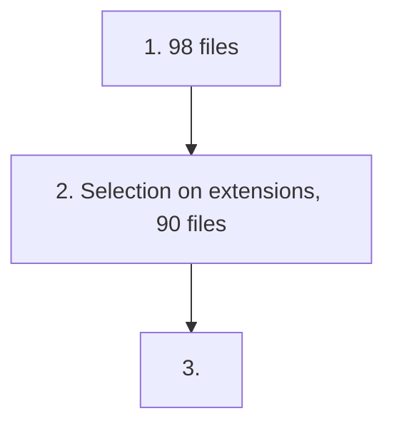

# Procedure

## Descriptive procedure

1. Start out with 98 files
2. Select only following file extensions (90 files):
   - `.xls(x)` (20 files)
   - `.csv` (61 files)
   - `.txt` (6 files)
   - `.dat` (3 files)
3. Extract machine readable data
4. Save summary information on rows and columns
5. For each dataset collect a random sample of the minimum of rows/columns present in the data or the 75th percentile from step 4
6. Collate all into one principal data set of nonidentifying information

Issues with the automated data collation were dealt with on an iterative basis (e.g., adding a missing column name). Issues that could not be resolved and hampered machine readability without manual interference were present for:

- `8.xls` - the dataset includes the first names of the coders. We deemed this non-identifying before because they were experimenters not participants, but it still doesn't seem ideal for the current usage so we decided to drop this dataset
- `61.csv` - reports multiple experiments in one file, which requires manual restructuring to be machine-readable

These files were manually removed from the set.

### Flowchart



## Code implementation

This is also implemented in `script.R` directly.

```r
if(!require(readxl)) install.packages('readxl')
if(!require(dplyr)) install.packages('dplyr')

#####################################################
# Make sure to unzip nonidentifying_data.zip first! #
#####################################################

# Get the rows/columns of the information (created on a previous run)
infoDat <- read.csv('summary-rows-cols.csv')
# Select out the ones without rows/columns
infoSel <- infoDat[!infoDat$rows == 0 | !infoDat$columns == 0,]
rowsP75 <- summary(infoSel$rows)[5]
columnsP75 <- summary(infoSel$columns)[5]

# Get all file names of relevance
folder <- 'nonidentifying_data'
# Ensure there is no previous `principal-dataset.csv` already there!
# This script will only create a new file if there is none, otherwise it'll append.
principalFileName <- 'principal-dataset.csv'
filesLocal <- list.files(folder)
filesSelect <- filesLocal[grepl(x = filesLocal, pattern = "*.(xls|xlsx|csv|dat|txt)")]

# Scaffold objects to save to
principalFile <- data.frame()
fileName <- c()
rows <- c()
columns <- c()

# Get the summary information on each datafile and sheet
for (file in filesSelect) {
    if (grepl(file, pattern = "*.(xls|xlsx)")) {
        sheetsFile <- excel_sheets(sprintf('%s/%s', folder, file))
        for (sheet in sheetsFile) {
            fileData <- read_excel(sprintf('%s/%s', folder, file), sheet, col_names = FALSE)

            # Collect summary-rows-cols
            fileName <- c(fileName, sprintf('%s_%s', file, sheet))
            rows <- c(rows, dim(fileData)[1])
            columns <- c(columns, dim(fileData)[2])
            
            # Sample data from file
            write.table(fileData[sample(1:dim(fileData)[1], size = min(dim(fileData)[1], rowsP75)), sample(1:dim(fileData)[2], size = min(dim(fileData)[2], columnsP75))], principalFileName, append = TRUE, sep = ',', row.names = FALSE, col.names = FALSE)
        }
    } else if (grepl(file, pattern = "*.csv")) {
        fileData <- read.csv(sprintf('%s/%s', folder, file))

        # Collect summary-rows-cols
        fileName <- c(fileName, sprintf('%s', file))
        rows <- c(rows, dim(fileData)[1])
        columns <- c(columns, dim(fileData)[2])
        
        # Sample data from file
        write.table(fileData[sample(1:dim(fileData)[1], size = min(dim(fileData)[1], rowsP75)), sample(1:dim(fileData)[2], size = min(dim(fileData)[2], columnsP75))], principalFileName, append = TRUE, sep = ',', row.names = FALSE, col.names = FALSE)
    } else if (grepl(file, pattern = "*.dat")) {
        fileData <- read.table(sprintf('%s/%s', folder, file))

        # Collect summary-rows-cols
        fileName <- c(fileName, sprintf('%s', file))
        rows <- c(rows, dim(fileData)[1])
        columns <- c(columns, dim(fileData)[2])

        # Sample data from file
        write.table(fileData[sample(1:dim(fileData)[1], size = min(dim(fileData)[1], rowsP75)), sample(1:dim(fileData)[2], size = min(dim(fileData)[2], columnsP75))], principalFileName, append = TRUE, sep = ',', row.names = FALSE, col.names = FALSE)
    } else if (grepl(file, pattern = "*.txt")) {
        fileData <- read.table(sprintf('%s/%s', folder, file), sep = ifelse(grepl(x = file, pattern = "^(4|13|63)"), '\t', ','), fileEncoding = ifelse(file == "13.txt", "utf-16le", ""))
       
        # Collect summary-rows-cols
        fileName <- c(fileName, sprintf('%s', file))
        rows <- c(rows, dim(fileData)[1])
        columns <- c(columns, dim(fileData)[2])

        # Sample data from file
        write.table(fileData[sample(1:dim(fileData)[1], size = min(dim(fileData)[1], rowsP75)), sample(1:dim(fileData)[2], size = min(dim(fileData)[2], columnsP75))], principalFileName, append = TRUE, sep = ',', row.names = FALSE, col.names = FALSE)
    }
}

# You could uncomment this to create the summary-rows-cols in the parent folder
# write.csv(data.frame(fileName, rows, columns), 'summary-rows-cols.csv', row.names = FALSE)
```
